# App Performance Optimization Design

## Overview

This design document outlines a comprehensive performance optimization strategy for the Vibely mobile music application to eliminate blocking, loading delays, app freezing, and ensure smooth functionality across all device tiers and network conditions.

## Current Performance Challenges

### Authentication Blocking Issues
- Firebase auth state checks causing 500ms-2s delays on app startup
- Onboarding flow blocking when auth services fail to load
- Spotify/Apple Music authentication timeouts causing indefinite loading states

### Loading State Problems
- Excessive loading indicators without meaningful feedback
- Component-level loading states blocking user interactions
- Image loading blocking UI rendering
- Music service initialization causing app freezes

### Device Performance Variations
- Low-end devices experiencing significant lag with animations and transitions
- High memory usage causing crashes on devices with <3GB RAM
- Battery drain issues from continuous background processing

### Network Dependency Issues
- App becoming unusable during poor network conditions
- Large bundle sizes causing slow initial loads
- Excessive API calls during onboarding

## Performance Architecture Strategy

### Device-Aware Adaptive System

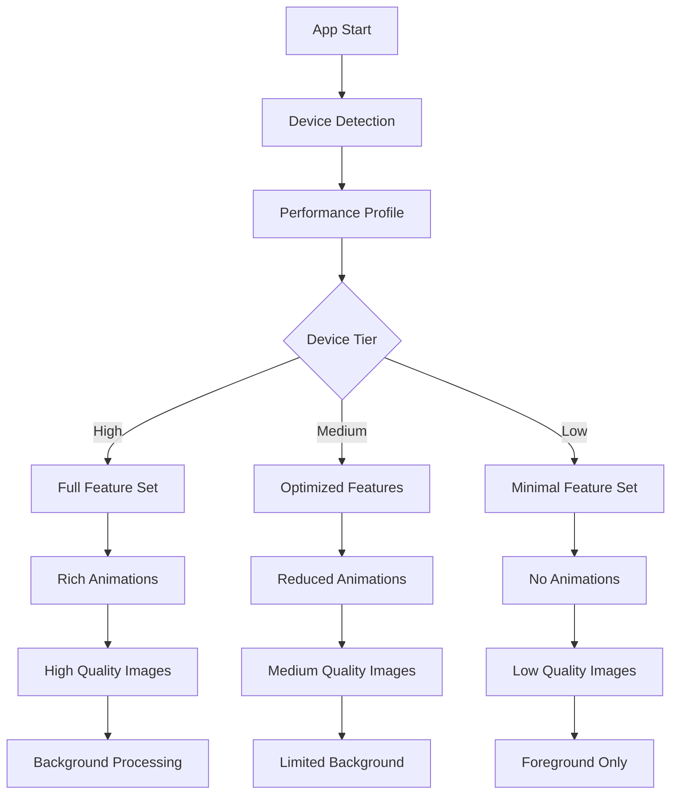

### Performance Tiers Implementation

| Tier | Memory | CPU Cores | Features |
|------|--------|-----------|----------|
| High | ≥6GB | ≥6 cores | Full animations, High-quality images, Background processing |
| Medium | 3-6GB | 4-6 cores | Reduced animations, Medium-quality images, Limited background |
| Low | <3GB | <4 cores | No animations, Low-quality images, Foreground only |

## Authentication Flow Optimization

### Non-Blocking Auth Strategy

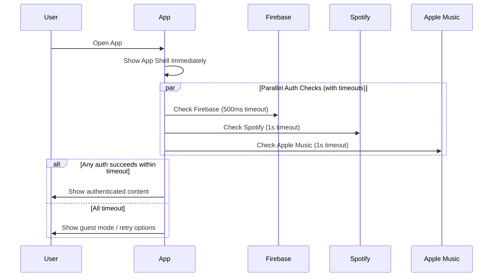

### Implementation Details

```typescript
interface AuthTimeoutConfig {
  firebase: 500;     // Critical auth - shortest timeout
  spotify: 1000;     // Music service - moderate timeout  
  appleMusic: 1000;  // Music service - moderate timeout
}

interface AuthState {
  status: 'loading' | 'authenticated' | 'guest' | 'error';
  services: {
    firebase: boolean;
    spotify: boolean;
    appleMusic: boolean;
  };
  allowGuestAccess: boolean;
}
```

## Loading State Elimination Strategy

### Progressive Loading Architecture

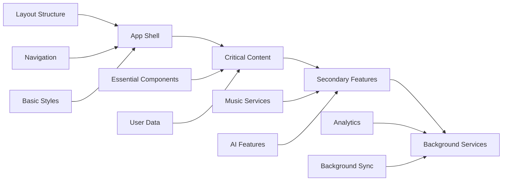

### Loading State Replacement

Replace blocking loading states with:

1. **Skeleton Screens**: Immediate visual feedback
2. **Progressive Enhancement**: Show basic functionality first
3. **Optimistic Updates**: Show expected results immediately
4. **Background Processing**: Move heavy operations off main thread

## Memory Management Optimization

### Memory-Aware Component Loading

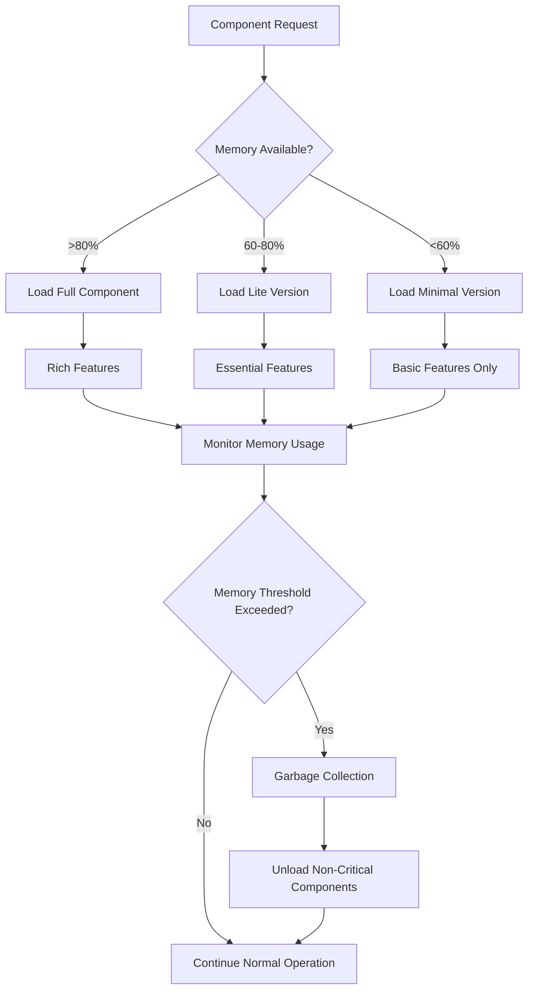

### Memory Management Implementation

```typescript
interface MemoryManagement {
  thresholds: {
    warning: 0.7;    // 70% memory usage
    critical: 0.85;  // 85% memory usage
    emergency: 0.95; // 95% memory usage
  };
  strategies: {
    warning: 'reduce-quality';
    critical: 'unload-components';
    emergency: 'minimal-mode';
  };
}
```

## Battery-Aware Performance System

### Battery Optimization Levels

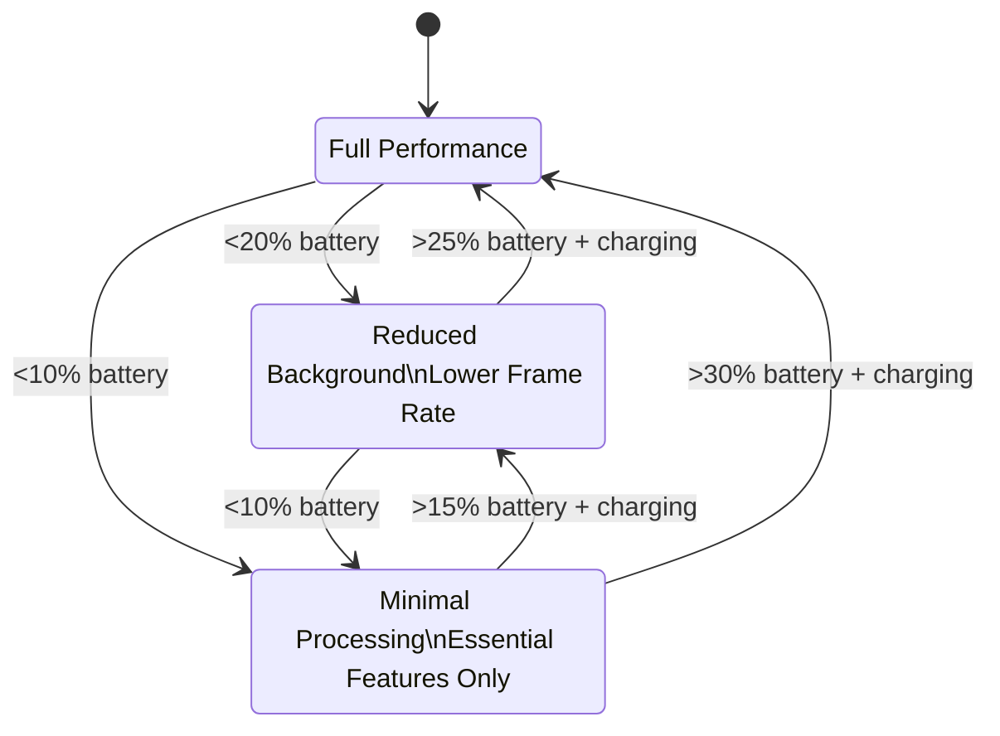

### Battery-Aware Features

| Battery Level | Animation Duration | Update Frequency | Background Processing |
|---------------|-------------------|------------------|----------------------|
| >20% | Normal (300ms) | 1000ms | Full |
| 10-20% | Reduced (150ms) | 2000ms | Limited |
| <10% | Disabled (0ms) | 5000ms | Essential Only |

## Network Resilience Architecture

### Offline-First Strategy

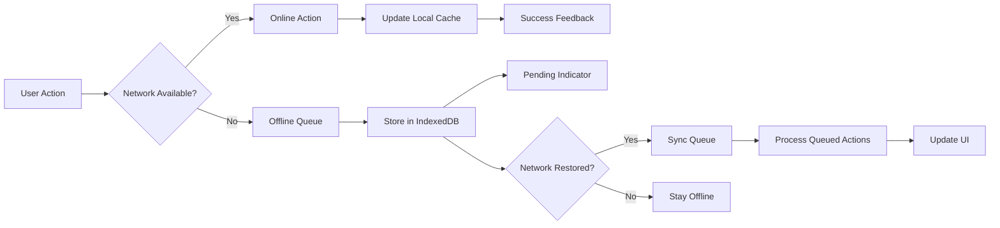

### Network-Aware Loading

```typescript
interface NetworkAdaptation {
  connection: {
    'slow-2g': { imageQuality: 'low', preload: false, concurrent: 1 };
    '2g': { imageQuality: 'low', preload: false, concurrent: 2 };
    '3g': { imageQuality: 'medium', preload: true, concurrent: 4 };
    '4g': { imageQuality: 'high', preload: true, concurrent: 8 };
  };
}
```

## Component Optimization Strategy

### Lazy Loading with Smart Preloading

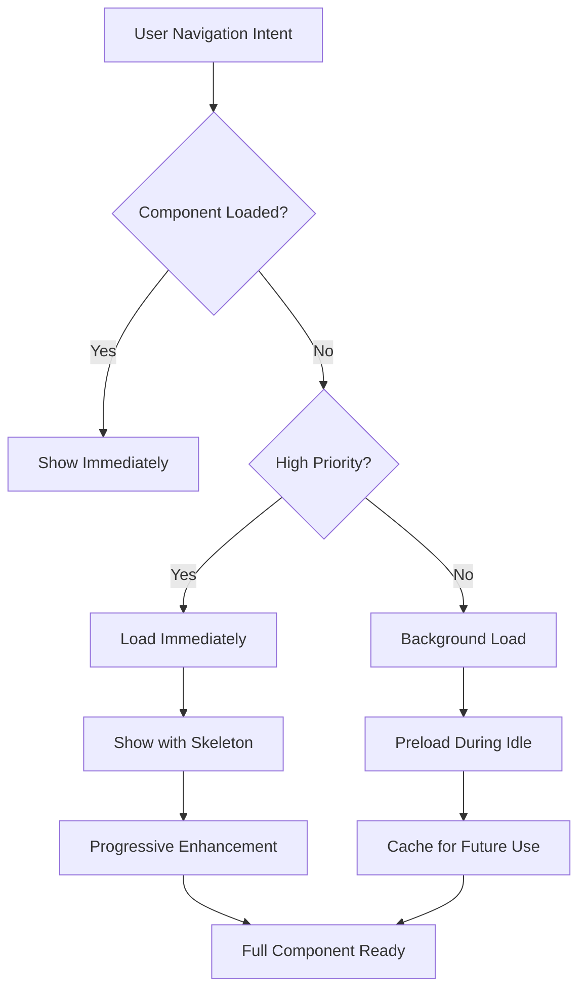

### Code Splitting Strategy

```typescript
interface CodeSplittingConfig {
  routes: {
    critical: string[];    // Load immediately
    important: string[];   // Preload on idle
    secondary: string[];   // Load on demand
    background: string[];  // Load in background
  };
  
  chunkSizes: {
    vendor: 244;    // KB
    common: 100;    // KB
    route: 50;      // KB per route
  };
}
```

## Image Optimization Architecture

### Adaptive Image Loading

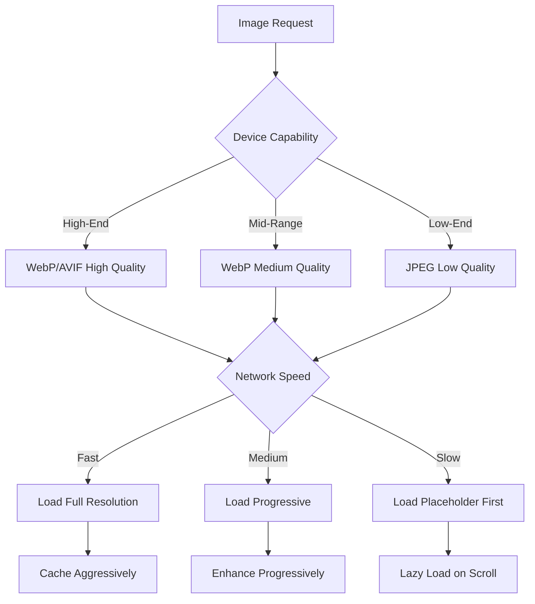

### Image Loading Strategy

| Device Tier | Format | Quality | Max Size | Loading |
|-------------|--------|---------|----------|---------|
| High | AVIF/WebP | 95% | 1920px | Immediate |
| Medium | WebP | 80% | 1080px | Progressive |
| Low | JPEG | 60% | 640px | Lazy |

## Audio Performance Optimization

### Battery-Aware Audio Processing

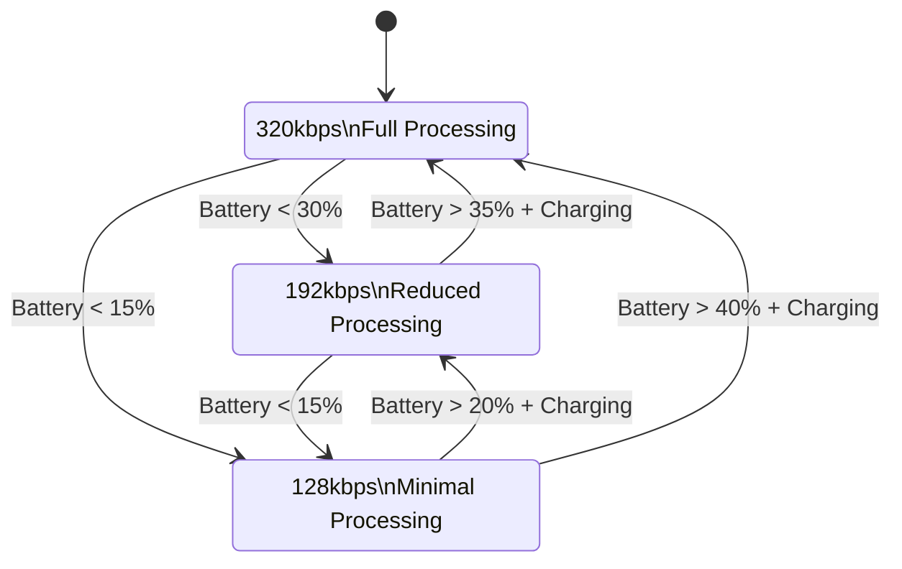

### Audio Optimization Levels

```typescript
interface AudioOptimization {
  levels: {
    high: { bitrate: 320, buffer: 'large', effects: true };
    medium: { bitrate: 192, buffer: 'medium', effects: false };
    low: { bitrate: 128, buffer: 'small', effects: false };
  };
  
  triggers: {
    batteryLevel: number;
    memoryUsage: number;
    thermalState: string;
  };
}
```

## Onboarding Flow Optimization

### Non-Blocking Onboarding Architecture

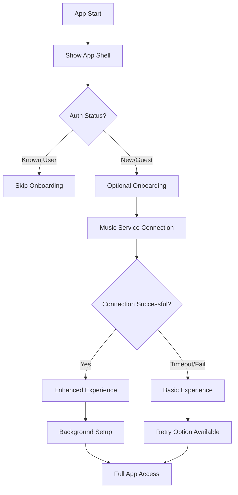

### Onboarding Timeout Strategy

```typescript
interface OnboardingTimeouts {
  steps: {
    authCheck: 500;        // ms
    musicService: 2000;    // ms
    photoPermission: 1000; // ms
    setupComplete: 3000;   // ms
  };
  
  fallbacks: {
    authCheck: 'guestMode';
    musicService: 'skipStep';
    photoPermission: 'skipStep';
    setupComplete: 'basicApp';
  };
}
```

## Performance Monitoring & Analytics

### Real-Time Performance Tracking

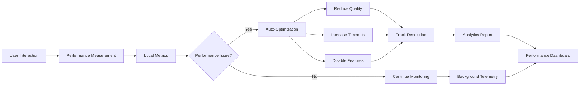

### Performance Metrics Tracking

```typescript
interface PerformanceMetrics {
  core: {
    FCP: number;           // First Contentful Paint
    LCP: number;           // Largest Contentful Paint
    FID: number;           // First Input Delay
    CLS: number;           // Cumulative Layout Shift
  };
  
  app: {
    authTime: number;      // Authentication duration
    musicLoadTime: number; // Music service initialization
    imageLoadTime: number; // Average image load time
    routeTransition: number; // Navigation performance
  };
  
  device: {
    memoryUsage: number;   // Current memory consumption
    batteryLevel: number;  // Battery percentage
    thermalState: string;  // Device temperature
    networkType: string;   // Connection quality
  };
}
```

## Testing Strategy

### Performance Testing Framework

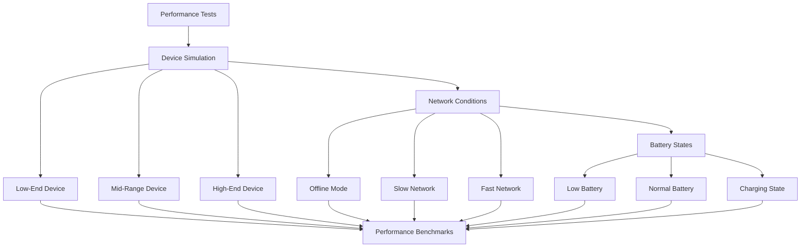

### Test Scenarios

| Test Case | Device | Network | Battery | Expected Outcome |
|-----------|--------|---------|---------|------------------|
| Cold Start | Low-End | 2G | 15% | App loads <3s, basic functionality |
| Navigation | Mid-Range | 3G | 50% | Route changes <500ms |
| Music Load | High-End | 4G | 80% | Music ready <2s, full features |
| Offline Use | Any | Offline | Any | Core functions work, queue actions |

## Implementation Priority

### Phase 1: Critical Path Optimization (Week 1-2)
1. **Authentication Timeout Implementation**
   - Add 500ms Firebase auth timeout
   - Implement guest mode fallback
   - Remove blocking loading screens

2. **Device Detection & Adaptive Loading**
   - Implement device capability detection
   - Create performance tier classification
   - Add memory usage monitoring

### Phase 2: Loading State Elimination (Week 3-4)
1. **Skeleton Screen Implementation**
   - Replace loading spinners with skeleton screens
   - Add progressive content loading
   - Implement optimistic UI updates

2. **Component Lazy Loading**
   - Split large components
   - Add intelligent preloading
   - Implement code splitting optimization

### Phase 3: Resource Optimization (Week 5-6)
1. **Image Loading Optimization**
   - Add adaptive image quality
   - Implement progressive loading
   - Add smart caching strategies

2. **Audio Performance Optimization**
   - Add battery-aware audio processing
   - Implement background audio optimization
   - Add network-aware streaming quality

### Phase 4: Background Processing (Week 7-8)
1. **Service Worker Enhancement**
   - Add offline functionality
   - Implement background sync
   - Add intelligent caching

2. **Performance Monitoring**
   - Add real-time performance tracking
   - Implement automatic optimization
   - Add performance analytics dashboard

## Success Metrics

### Performance Targets

| Metric | Current | Target | Measurement |
|--------|---------|---------|-------------|
| Initial Load Time | 3-5s | <2s | Time to interactive |
| Auth Check Time | 2s+ | <500ms | Firebase response |
| Route Transition | 1s+ | <300ms | Navigation speed |
| Memory Usage | Variable | <80% | Device memory |
| Battery Impact | High | <20%/hr | Background usage |
| Offline Functionality | None | 80% | Feature availability |

### User Experience Metrics

- **App Responsiveness**: <16ms response time for user interactions
- **Loading Perception**: Zero visible loading states >1s
- **Offline Capability**: Core features work without internet
- **Battery Efficiency**: <20% battery drain per hour of active use
- **Memory Stability**: No crashes due to memory pressure
- **Cross-Device Consistency**: Smooth experience across all device tiers


